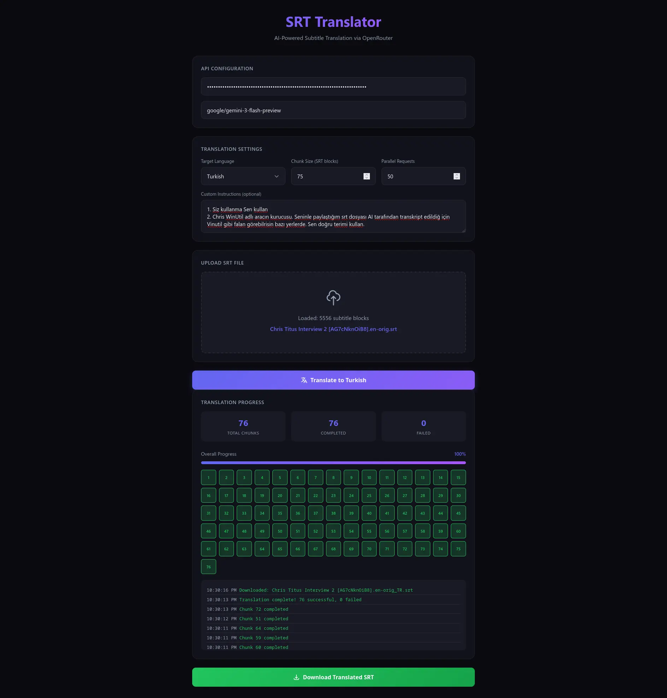

# SRT Translator

A powerful, browser-based tool for translating SRT subtitle files using AI. Built for speed, accuracy, and ease of use.



## 🎯 What Problem Does It Solve?

Translating subtitles is tedious and expensive:
- **Manual translation** is slow and costly
- **Generic AI translation** loses subtitle timing and structure
- **Existing tools** don't handle the unique challenges of SRT format (split sentences, timing markers, etc.)

**SRT Translator** solves this by:
1. Preserving original timestamps by default (optional timing extension is available)
2. Using a smart marker system to maintain line-by-line correspondence
3. Processing chunks in parallel for maximum speed
4. Allowing custom instructions for domain-specific terminology

## ✨ Features

- **API Provider Toggle** - Use **Google AI Studio (Gemini API)** directly or connect via **OpenRouter**
- **Drag & Drop** - Just drop your SRT file and start translating
- **Smart Split-Sentence Merging** - Automatically merges short trailing subtitle blocks (like single words) into the previous block if they are part of the same sentence, preventing them from flashing on screen too fast and providing the AI with better context.
- **Extend Short Subtitles** - Automatically increase display time for fast subtitles with custom safety gaps
- **Arabic & Persian Bidirectional Formatting** - Wrap lines in Unicode RLE/PDF embedding tags and automatically replace standard English punctuation with proper RTL punctuation (`،`, `؟`, `؛`) so that video players (like VLC) render text and word order correctly
- **Safe Parallel Requests** - Defaults to `5` parallel requests to avoid free tier rate-limiting (429), customizable up to `100` for premium plans
- **Smart Chunking** - Processes 20 subtitle blocks per request for optimal translation accuracy
- **Marker-Based Alignment** - Uses custom boundaries so each subtitle block stays aligned with its timestamp
- **Custom Instructions** - Add custom parameters (e.g. "Use informal tone", "Do not translate coding tags")
- **Multi-Language** - Translate to 20+ popular languages, including **Persian**
- **Real-Time Progress** - Visual feedback for chunk progress, errors, and rate-limit countdown timers
- **Smart Quota Retry** - Automatically parses Google's `RetryInfo` on 429 quota errors and counts down the exact cooldown delay before resuming

## 🚀 Quick Start

1. Open `index.html` in your browser (double-click the file)
2. Select your **API Provider** (Google AI Studio or OpenRouter) and enter your API Key
3. Drop an SRT file into the upload zone
4. Select target language (e.g., Persian, Arabic, Spanish)
5. (Optional) Toggle **Merge short split sentences** or **Extend short subtitles**
6. Click **Translate**
7. Click **Download Translated SRT**
8. OR OPEN https://msajjad067.github.io/subtitle-translate/
and use it.

## ⚙️ Configuration

| Setting | Default | Description |
|---------|---------|-------------|
| **API Provider** | `Google AI Studio` | Choose direct Gemini API or OpenRouter |
| **Model** | `gemini-3.1-flash-lite` | default model ID (`google/gemini-3.1-flash-lite` on OpenRouter) |
| **Chunk Size** | 20 | Number of subtitle blocks per API request |
| **Parallel Requests** | 5 | Safe concurrent API requests to avoid rate limits (exceeding 15 RPM) |

### Recommended Settings

- **Chunk Size: 20**: Recommended for better precision. Smaller chunks mean less text drift between subtitle blocks and more accurate timing alignment.
- **Parallel Requests: 5**: Highly recommended for the Gemini Free Tier to keep your request rate below the 15 requests-per-minute (RPM) quota. If you have a pay-as-you-go key, you can increase this to `50` or `100` for faster speed.

For the best **performance/cost** balance, we recommend:

```
gemini-3.1-flash-lite
```

This model offers:
- Extremely fast response times
- High instruction following capability
- Excellent cost-effective translation quality

Other options:
- `gemini-1.5-pro` / `gemini-1.5-flash` - Supported via custom model input field.

## 🧠 How It Works

### The Problem: Text Drift

Subtitles split sentences across multiple timed blocks. The problem? **Languages have different structures.** 

English (SVO): "I **love** you" → Subject, Verb, Object  
Turkish (SOV): "Seni **seviyorum**" → Object, Subject+Verb

When you translate subtitle blocks independently, the words end up in wrong timestamps:

```
English Subtitles:          Turkish (Naive Translation):
━━━━━━━━━━━━━━━━━━━━━━━━━━━━━━━━━━━━━━━━━━━━━━━━━━━━━━━━━━
[00:01] "I will not"    →   [00:01] "Bunu yapmayacağım"  ← Too long!
[00:02] "do this."      →   [00:02] ""                    ← Empty!
```

The AI translated the full sentence in Block 1, leaving Block 2 empty. Now timing is broken.

### The Solution: Markers

We inject `[B#]` markers to create explicit boundaries:

**Input to AI:**
```
[B1] Hello and welcome to
[B2] a new episode. Today we have
[B3] Chris Titus with us.
```

**AI Output:**
```
[B1] Merhaba ve yeni bir
[B2] bölüme hoş geldiniz. Bugün yanımızda
[B3] Chris Titus var.
```

Each marker acts as an anchor:
- `[B1]` content stays in Block 1's timestamp
- `[B2]` content stays in Block 2's timestamp
- Sentence boundaries can span blocks - that's fine!

### Smart Chunking

Chunks don't break at fixed sizes. We look for natural sentence endings (`. ! ?`) within the last 10 blocks:

```
Target: 20 blocks
Actual: 23 blocks (because sentence ends at block 23)
```

### Translation Priority

1. **Line Structure** (Mandatory) - Each `[B#]` stays on its own line
2. **Natural Translation** - Idiomatic, not word-for-word
3. **Word Count** (Soft) - Similar length per line when possible

### Optional Pre-processing (Off by Default)

These checkboxes change subtitle blocks **before** translation. They are disabled by default so the core chunking and marker logic stays unchanged unless you opt in.

| Option | What it does | Important notes |
|--------|--------------|-----------------|
| **Merge short split sentences** | Joins very short trailing blocks (e.g. a single word) into the previous block when they look like the same sentence | Reduces block count, which also changes chunk boundaries. Heuristics are tuned for Latin-script subtitles (punctuation + capital-letter checks). Test on your language before relying on it. |
| **Extend short subtitles** | Extends blocks shorter than ~1.3s, keeping a 50ms gap before the next subtitle | Modifies timestamps. Useful for readability, but no longer a byte-for-byte timing copy. |

### API Provider Notes

- **Google AI Studio** and **OpenRouter** use separate API keys, each stored in `localStorage` under its own key.
- Default model IDs differ by provider: `gemini-3.1-flash-lite` (Google) vs `google/gemini-3.1-flash-lite` (OpenRouter).
- If you switch providers, clear or update the custom model field when the model ID format does not match the new provider.
- API keys are trimmed on save, load, and request to avoid accidental whitespace causing auth failures.
- On Gemini free tier, keep **Parallel Requests** at `5` (default) to stay under typical RPM quotas. Increase only if your plan allows it.

### RTL Output (Arabic & Persian)

For Arabic and Persian targets, translated lines receive:
- RTL punctuation normalization (`،`, `؟`, `؛`)
- Unicode bidirectional markers (RLM, RLE, PDF) so mixed English/RTL text renders correctly in players like VLC

## 📁 Project Structure

```
srt-translator/
├── index.html          # Main UI entry point
├── README.md           # Documentation
├── src/
│   ├── app.js          # Core application logic
│   └── styles.css      # Dark theme styling
└── assets/
    └── ui.webp         # UI screenshot
```

## 🔧 Custom Instructions Examples

**Turkish informal:**
```
Türkçe çeviride "siz" yerine "sen" formu kullan.
```

**Technical content:**
```
Keep technical terms like "API", "SDK", "cache" untranslated.
```

**YouTube tone:**
```
Use casual, engaging language suitable for YouTube videos.
```

## 📝 API Requirements

- **Providers:** [Google AI Studio](https://aistudio.google.com/) (direct API keys) or [OpenRouter](https://openrouter.ai/) (multi-model gateway)
- **API Keys:** Get a Gemini API key at [Google AI Studio Keys](https://aistudio.google.com/app/apikey) or OpenRouter API key at [OpenRouter Keys](https://openrouter.ai/keys)
- **Models:** Defaults to `gemini-3.1-flash-lite` (Google AI Studio) and `google/gemini-3.1-flash-lite` (OpenRouter). Any custom compatible model is supported.

## 🛡️ Privacy

- Your API key is stored locally in your browser (localStorage)
- SRT files are processed client-side
- Only subtitle text is sent to the AI API
- No data is stored on any server

## 📄 License

GPL-3.0 License
---

Built with ❤️ for content creators who need fast, accurate subtitle translations.
